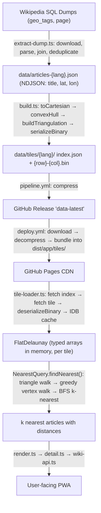

# Architecture Overview

WikiRadar is a Wikipedia-powered tour guide PWA. It uses spherical Delaunay triangulation to find nearby geotagged Wikipedia articles in O(√N) expected time (dominated by the triangle walk; see query details in Phase 3). The system has three phases: **extract** (Wikipedia dumps → article coordinates), **pipeline** (coordinates → per-tile binary triangulations), and **app** (tiles → nearest-neighbor queries → UI).

## End-to-End Data Flow



## Phase 1: Extraction

**Entry point:** `src/pipeline/extract-dump.ts` — `npm run extract -- --lang=en`

Downloads two SQL dump files from `dumps.wikimedia.org` per language:

- `page.sql.gz` — article titles and IDs (~2 GB for English)
- `geo_tags.sql.gz` — geographic coordinates linked to page IDs (~600 MB)

The extraction downloads dumps, parses and joins the SQL tables, deduplicates by title, validates against known landmarks, and writes NDJSON. See [data-extraction.md](data-extraction.md) for the full step-by-step process.

**Output:** `data/articles-{lang}.json` (NDJSON, one article per line).

## Phase 2: Pipeline (Triangulation Build)

**Entry point:** `src/pipeline/build.ts` — `npm run pipeline -- --lang=en`

Reads extracted NDJSON and produces per-tile binary files for the app:

1. **Read articles** — Parses NDJSON, applies optional `--limit` and `--bounds` filters.
2. **Assign to tiles** — Each article maps to a 5° lat/lon grid cell. See `docs/tiling.md` for the tiling strategy.
3. **Build per-tile triangulations** — For each populated tile, collect native articles plus a 0.5° buffer zone, then: `toCartesian` → `convexHull` → `buildTriangulation` → `serializeBinary`. Tiles with fewer than 4 articles are skipped.
4. **Write tile index** — `data/tiles/{lang}/index.json` manifest listing all tiles with bounding boxes, article counts, byte sizes, and content hashes.

**Output:** `data/tiles/{lang}/` (index.json + per-tile .bin files)

### Binary Format

Each tile is a compact binary blob containing a 24-byte header, four typed-array sections (vertex coordinates, vertex-to-triangle mapping, triangle vertices, triangle neighbors), and a UTF-8 JSON article title array. See [binary-format.md](binary-format.md) for the full byte-level specification.

Float32 vertices give sub-meter precision on Earth. On deserialization, Uint32 index sections are zero-copy views into the original ArrayBuffer; Float32 vertices are copied into Float64Arrays for numerical stability.

## Phase 3: App (PWA Frontend)

**Root:** `src/app/` — `npm run dev`

### Startup

1. Register service worker (auto-update: new versions install automatically; the app shows a "Reload" banner via the `showAppUpdateBanner` effect)
2. Load triangulation for stored language (default: English)
3. Show welcome screen with language selector, "Use my location" / "Pick a spot on the map" buttons, and an About link
4. On start: begin GPS watch, render article list in viewport mode (a short, GPS-updated list). When the user scrolls past a threshold or manually pauses, the view transitions to infinite scroll mode (see [infinite-scroll.md](infinite-scroll.md)).

### Data Loading (`tile-loader.ts`)

The app uses geographic tiling — instead of downloading a monolithic file, it fetches a small tile index and then loads only nearby tiles on demand:

1. **Fetch tile index** — `loadTileIndex()` fetches `tiles/{lang}/index.json` (small manifest of all tiles with content hashes). Cached in IDB for offline use.
2. **Determine tiles** — `tilesForPosition()` computes the primary tile from the user's GPS position plus adjacent tiles if the user is within 1° of a tile boundary.
3. **Load tiles** — `loadTile()` fetches individual `.bin` files, calls `deserializeBinary()` (Float32→Float64 upcast for math precision, Uint32 views are zero-copy), and caches the result in IDB keyed by `tile-v1-{lang}-{id}` with content hash for freshness.
4. **IDB cache hit** — Returns instantly (~1ms). Compares the cached tile's hash against the index; only refetches tiles whose hash changed.

IDB uses a single object store (created via `onupgradeneeded`) with versioned key prefixes (e.g. `tile-index-v1-{lang}`, `tile-v1-{lang}-{id}`, `tile-lru-v1-{lang}`). Data migration is handled by bumping the version in the prefix — old keys are orphaned and cleaned up on startup, avoiding the need for `onupgradeneeded`-based data migration. This strategy works because all data shares one object store; adding a second store would require bumping the IDB version and using `onupgradeneeded`. See `idb.ts` for the full key inventory.

### Nearest-Neighbor Query (`query.ts`)

The `NearestQuery` class wraps the flat Delaunay data for a single tile and provides `findNearest(lat, lon, k)`. Cross-tile merging is handled by `findNearestTiled()` in `tile-loader.ts`, which queries each loaded tile independently, de-duplicates by title, sorts by distance, and returns the top k.

Per-tile query steps:

1. **Triangle walk** (`flatLocate`) — Starting from `defaultTriangle` (or a warm-start hint), walk adjacent triangles by testing which edge the query point lies outside of. Each step crosses to the neighbor sharing that edge. Converges in O(√N) steps.
2. **Seed vertex** — The closest vertex of the containing triangle.
3. **Greedy vertex walk** — Check all Delaunay neighbors of the current best; move to any closer one. Repeat until no improvement.
4. **BFS expansion** (k > 1) — Expand from the nearest vertex through Delaunay edges, collecting max(2k, k+6) candidates. Sort by distance, return top k.

Distance uses chord length (`2 * asin(||v - q|| / 2)`, clamped for numerical safety) rather than `acos(dot(v, q))` to avoid catastrophic cancellation with Float32-precision coordinates.

### Rendering (`render.ts`, `detail.ts`)

**List view:**

- Article cards with distance badges
- Language selector dropdown, GPS/Pin position source toggle, pause/resume button, and About button in header
- Virtual infinite scroll with progressive tile loading (see [infinite-scroll.md](infinite-scroll.md))
- Smart re-render with two paths: if the article list is unchanged, `updateDistances` patches only the distance badges in-place. If articles change, `reconcileListItems` matches existing DOM nodes by article title — reused nodes keep their enrichment (thumbnails, descriptions fetched from Wikipedia) and only get a badge update, while new articles get fresh nodes. This title-keyed reconciliation is why enrichment survives GPS-triggered re-renders even as the article list shifts.
- Re-query threshold: 15m minimum movement before recalculating

**Detail view:**

- Fetches article summary from Wikipedia REST API (`wiki-api.ts`)
- Displays thumbnail, description, extract, and links to Wikipedia and platform-native directions (Apple Maps on iOS, geo: URI on Android, Google Maps on desktop)
- In-memory cache for API responses

### PWA Manifest & Service Worker (`vite.config.ts`)

The VitePWA plugin generates a web app manifest (`name: "WikiRadar"`, `display: "standalone"`, `theme_color: "#1a73e8"`). Icon assets: `icon.svg`, `icon-192.png`, `icon-512.png`, `apple-touch-icon.png`.

- Static assets (JS, CSS, HTML, SVG) are precached by Workbox
- `.bin` and `.json` data files use `NetworkOnly` — deliberately excluded from SW cache so that freshness checks always hit the server (the app manages its own IDB cache)
- Wikipedia REST API responses use `StaleWhileRevalidate` (max 200 entries, 1-week expiry)
- HTTPS dev server (required for geolocation API) with `0.0.0.0` binding for phone testing

### Failure Modes

The app is designed for mobile networks where failures are common. Each subsystem degrades gracefully:

| Scenario                                                                                         | Behavior                                                                                                                                                                                                                                             | User experience                                                                                                 |
| ------------------------------------------------------------------------------------------------ | ---------------------------------------------------------------------------------------------------------------------------------------------------------------------------------------------------------------------------------------------------- | --------------------------------------------------------------------------------------------------------------- |
| **Tile fetch failure**                                                                           | Effect executor dispatches `tileLoadFailed` event to the state machine, which tracks failures in `loadingTiles`; if all pending tiles fail during the loading phase, transitions to empty browsing                                                   | Results from other loaded tiles still display; if no tiles load at all, the app shows an empty state            |
| **Binary deserialization failure** (corrupt `.bin`, truncated download, format version mismatch) | `deserializeBinary` validates magic bytes (`"WKRD"`), format version, section bounds, and article JSON — throws `BinaryFormatError` on any mismatch; `loadTile` propagates the error, which is caught and logged; app continues with remaining tiles | Same as tile fetch failure — results from other tiles still display; corrupt tile is not cached in IDB          |
| **Tile index fetch failure**                                                                     | Falls back to IDB-cached index if available; if no cache, transitions to "data unavailable" screen                                                                                                                                                   | Offline revisit works; first-time offline shows language picker with "No data available" message                |
| **IndexedDB unavailable** (private browsing, quota exceeded)                                     | `idbOpen()` logs `console.warn` and returns `null`; the cached promise is cleared so subsequent calls retry (transient failures recover automatically); IDB reads/writes skip when `null` is returned                                                | App works normally but without caching — tiles reload from network on each visit; transient failures self-heal  |
| **IDB data corruption** (invalid JSON, schema mismatch, partial writes)                          | Corrupted LRU lists fall back to empty (fresh start); corrupted tile cache entries are treated as cache misses and re-fetched from the network; no error propagates to the state machine                                                             | App continues operating normally — user sees no difference except a one-time network refetch for affected tiles |
| **GPS denied**                                                                                   | State machine transitions to error screen with message and "Pick on map" button                                                                                                                                                                      | User can grant permission and retry, or pick a location on the map                                              |
| **GPS timeout/unavailable**                                                                      | Same as GPS denied — error screen with map picker option                                                                                                                                                                                             | Explicit user action required to proceed                                                                        |
| **Wikipedia API failure**                                                                        | Detail view shows error with "Retry" button and direct "Open on Wikipedia" link                                                                                                                                                                      | User can retry or read the article on Wikipedia directly                                                        |
| **Wikipedia API 404**                                                                            | Treated as "article not found"                                                                                                                                                                                                                       | Detail view shows error; Wikipedia link still works as fallback                                                 |

Key design decisions:

- **GPS errors are phase-gated:** Only processed during the "locating" phase. GPS errors that arrive while the user is already browsing are silently ignored to avoid disrupting an active session.
- **Three independent cache layers:** IDB (tile data, survives reload), in-memory LRU (article summaries, session-scoped), and Workbox runtime cache (Wikipedia API, StaleWhileRevalidate). Each operates independently so one failing doesn't cascade.
- **No automatic retry for tile fetches:** Individual tile failures dispatch `tileLoadFailed` events that the state machine tracks alongside successful loads. The app shows results from whichever tiles succeed; if all pending tiles fail during loading, the state machine transitions to empty browsing rather than loading indefinitely.

### Security & Privacy

- **DOM rendering** — All user-visible text is rendered via `createElement`/`textContent`, not raw HTML injection (enforced by ESLint's `no-restricted-syntax` rule — `innerHTML`, `outerHTML`, `insertAdjacentHTML`, and `document.write` all fail CI). Wikipedia API responses are not injected as raw HTML.
- **GPS data** — Location coordinates are used only for on-device nearest-neighbor queries. No GPS data is transmitted to any server other than the browser's standard Geolocation API provider.
- **Third-party requests** — The only external requests are to Wikipedia's REST API (for article summaries) and GitHub Pages (for tile data). No analytics, tracking, or third-party scripts.
- **Service worker scope** — The SW caches static assets and Wikipedia API responses only. Tile data bypasses the SW cache (managed via IDB instead).

## CI/CD

### CI (`ci.yml`)

Runs on every push to `main` and on pull requests. Four parallel jobs:

1. **lint** — Prettier check (`npm run format`) then ESLint (`npm run lint:eslint`)
2. **type-check** — `tsc --noEmit`
3. **build** — `npm run build` (production build verification)
4. **test** — `npm run test:coverage` (vitest with coverage). Coverage artifacts are uploaded to GitHub Actions with 30-day retention.

### Data Pipeline (`pipeline.yml`)

Runs monthly (1st of month, 03:00 UTC) or on manual trigger. Languages processed in parallel:

1. **Extract** — Downloads Wikipedia dumps (cached between runs), joins tables, outputs NDJSON
2. **Build** — Runs pipeline to produce tiled output (`data/tiles/{lang}/`)
3. **Compress** — Archives tile directories
4. **Publish** — Uploads tile archives to a `data-latest` GitHub Release

Smart merge: downloads the existing release first, so rebuilding one language preserves the others.

### Deployment (`deploy.yml`)

Triggered manually via `workflow_dispatch`:

1. Downloads tile archives from `data-latest` release
2. Decompresses tile files
3. Builds the app (`npm run build`)
4. Copies tile directories into `dist/app/tiles/`
5. Deploys to GitHub Pages

Data and app code are decoupled — data updates don't require app rebuilds, and app deploys pull the latest data from the release.

## Geometry Library

All modules live under `src/geometry/` and are shared by the pipeline and app.

### Coordinate System

Points are represented as `Point3D = [x, y, z]` on a unit sphere. `toCartesian({lat, lon})` converts geographic coordinates:

```
x = cos(lat) × cos(lon)
y = cos(lat) × sin(lon)
z = sin(lat)
```

### Convex Hull (`convex-hull.ts`)

Incremental 3D convex hull algorithm. For unit-sphere points, hull faces are exactly the spherical Delaunay triangles.

**Core predicate:** `orient3D(a, b, c, d)` — signed volume of tetrahedron. Positive means `d` is visible from face `(a, b, c)`.

**Degeneracy handling:** Points receive ~1e-6 deterministic perturbation via a seeded LCG PRNG (reprojected onto the sphere) to prevent numerical ambiguity from coplanar/cospherical configurations. The fixed seed ensures reproducible builds.

**Per-insertion steps:**

1. Find a visible face via greedy walk from previous insertion point
2. BFS to discover all connected visible faces
3. Collect horizon edges (boundary between visible and non-visible)
4. Delete visible faces, create new faces connecting horizon to new point
5. Relink adjacency via half-edge map (edge `a→b` encoded as `a × N + b`)

**Spatial index:** `FaceGrid` (up to 128³ cells, scaling with ∛N) provides O(1) fallback when the greedy walk fails.

### Delaunay Triangulation (`delaunay.ts`)

`buildTriangulation(hull)` enriches hull output:

- Computes circumcenter and circumradius for each triangle
- Builds vertex-to-triangle mapping (entry point for walks)
- Drops interior points (those not on the hull), remaps indices
- Returns `SphericalDelaunay` with `originalIndices` mapping back to input

### Point Location (`point-location.ts`)

- `locateTriangle(tri, query, startTriangle?)` — Triangle walk: O(√N) steps
- `findNearest(tri, query, startTriangle?)` — Locate triangle → closest vertex → greedy walk through Delaunay neighbors
- `vertexNeighbors(tri, v)` — Walks the triangle fan around a vertex

All three are standalone functions taking a `SphericalDelaunay` as the first argument.

### Serialization (`serialization.ts`)

Two formats sharing the same logical structure:

|          | JSON (`TriangulationFile`)    | Binary         |
| -------- | ----------------------------- | -------------- |
| Vertices | `number[]` (8 decimal places) | `Float32Array` |
| Indices  | `number[]`                    | `Uint32Array`  |
| Articles | `string[]`                    | UTF-8 JSON     |
| Use case | Intermediate / debugging      | Production     |

`deserializeBinary()` copies Float32 vertices into Float64 for math precision. Uint32 sections are zero-copy typed array views directly into the ArrayBuffer.

## Key Files

```
src/pipeline/
  extract-dump.ts      Extraction entry point (SQL dumps → NDJSON)
  build.ts             Pipeline entry point (NDJSON → tiled binary)
  dump-download.ts     Streaming download with progress + retry
  dump-parser.ts       MySQL dump parser (gzip + SQL)
  canary.ts            Post-extraction landmark validation
  dump-test-fixtures.ts Test fixture generator for dump parser

src/geometry/
  index.ts             Coord conversion, distance, circumcenter
  convex-hull.ts       Incremental 3D convex hull
  delaunay.ts          Spherical Delaunay from convex hull
  point-location.ts    Triangle walk, greedy nearest-neighbor
  serialization.ts     Typed arrays ↔ binary format
  predicates.ts        Robust orient3D (Shewchuk)

src/app/
  main.ts              Bootstrap, language switching, wires lifecycles together
  state-machine.ts     Pure state machine (phase/event/effect)
  effect-executor.ts   Executes state machine effects (I/O bridge between pure state and side effects)
  query.ts             NearestQuery class (flat typed-array walks)
  tile-loader.ts       Tile index + tile fetching, IDB cache, LRU eviction
  idb.ts               IndexedDB helpers, versioned key prefixes
  lang-dropdown.ts     Custom language-selector dropdown for browsing header
  render.ts            Article list with distance badges
  about.ts             About dialog with Wikipedia and OSM attribution
  detail.ts            Article detail via Wikipedia REST API
  header.ts            App header element factory
  location.ts          Geolocation API wrapper
  status.ts            Loading, progress, error, welcome, and data-unavailable screens
  wiki-api.ts          Wikipedia REST API client
  format.ts            Distance formatting
  types.ts             Shared types
  style.css            UI styling
  index.html           PWA root

  # Infinite scroll subsystem
  article-window.ts           Distance-windowed data model (sync reads, async expansion)
  article-window-factory.ts   Wires ArticleWindow to TileRadiusProvider and state machine tiles
  article-window-lifecycle.ts Manages ArticleWindow instance, AbortController, reset/create/render orchestration
  tile-radius.ts              Progressive tile loading by Chebyshev ring distance; implements ArticleProvider
  virtual-scroll.ts           Pure viewport math (computeVisibleRange) + thin DOM adapter (VirtualList)
  enrich-scheduler.ts         Debounced enrichment trigger — fires after articles settle in viewport
  summary-loader.ts           Concurrency-limited, cancellable batch fetcher for article summaries
  scroll-pause-detector.ts    Fires callback when scroll passes a pixel threshold (window + container)
  debounced-map-sync.ts       Batches visible-range changes and syncs browse map markers after settle period
  infinite-scroll-lifecycle.ts Orchestrates virtualList, enrichScheduler, map sync, scroll as one lifecycle

  # Map lifecycles
  browse-map-lifecycle.ts     Lazy-loads, creates, updates, and tears down the browse map (rendered inside the map drawer)
  map-drawer.ts               Slide-in drawer panel that hosts the browse map; toggle via handle or swipe
  drawer-gesture.ts           Swipe/drag gesture handling for the map drawer
  map-picker-lifecycle.ts     Lazy-loads and manages the full-screen map picker overlay

src/lang.ts            Supported languages (en, de, fr, es, it, ru, zh, pt, pl, nl, ko, ar, sv, ja)
src/tiles.ts           Tile types, grid constants, tile ID computation, column wrapping

src/app/CLAUDE.md      Module-specific dev instructions (browser verification workflow)
src/pipeline/CLAUDE.md Module-specific dev instructions (extraction and pipeline commands)

.github/workflows/
  ci.yml               Four parallel jobs: lint (Prettier check then ESLint), type-check (tsc --noEmit), build (production build), test (vitest + coverage)
  pipeline.yml         Monthly data extraction + build (manual trigger accepts `langs` JSON array for selective rebuild)
  deploy.yml           App deployment to GitHub Pages
```

## See Also

- [Infinite Scroll](infinite-scroll.md) — Virtual scroll, article window, progressive tile loading, scroll-pause detection
- [State Machine](state-machine.md) — App state machine: phases, events, effects, transition table
- [Nearest-Neighbor Theory](nearest-neighbor.md) — Voronoi/Delaunay theory, spherical adaptation, 3D convex hull approach, triangle walks
- [Binary Format](binary-format.md) — Byte-level layout of `.bin` tile files
- [Tiling Strategy](tiling.md) — Geographic tiling scheme, buffer zones, boundary handling
- [Data Extraction](data-extraction.md) — Wikipedia dump extraction pipeline
- [CLAUDE.md](../CLAUDE.md) — Command reference and development workflow
