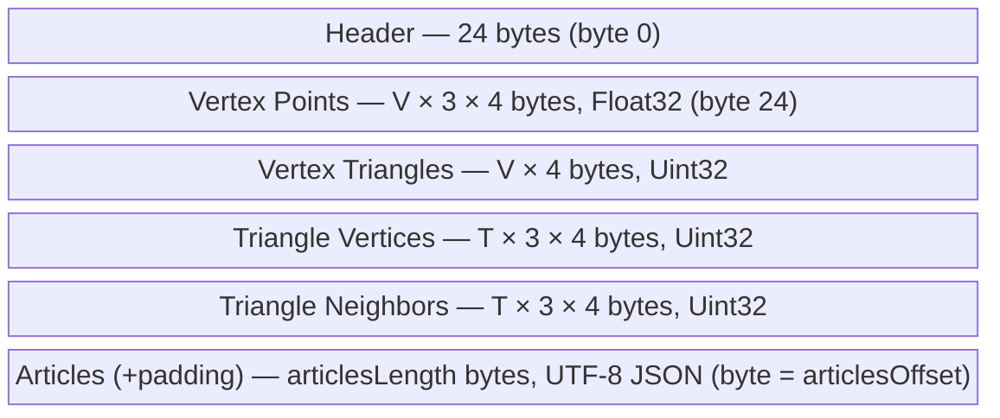

# Binary Serialization Format

The `.bin` files produced by the build pipeline (`npm run pipeline`) encode a spherical Delaunay triangulation and its associated article metadata in a single compact binary blob. This document specifies the byte-level layout so that anyone reading or modifying `lib/spherical-delaunay/src/serialization.ts` or `src/app/query.ts` knows exactly what to expect.

Notation: **V** = vertex count, **T** = triangle count. All multi-byte integers and floats are **little-endian**. All sections are **4-byte aligned**.

## Overview



## Header (24 bytes)

| Offset | Size | Type   | Field          | Description                                      |
| ------ | ---- | ------ | -------------- | ------------------------------------------------ |
| 0      | 4    | bytes  | magic          | Magic bytes `0x57 0x4B 0x52 0x44` (ASCII "WKRD") |
| 4      | 4    | Uint32 | version        | Format version (currently `1`)                   |
| 8      | 4    | Uint32 | vertexCount    | Number of vertices (V)                           |
| 12     | 4    | Uint32 | triangleCount  | Number of triangles (T)                          |
| 16     | 4    | Uint32 | articlesOffset | Byte offset where the articles JSON begins       |
| 20     | 4    | Uint32 | articlesLength | Byte length of the articles JSON (unpadded)      |

The deserializer validates magic bytes and version before reading any data. Unrecognized magic bytes or unsupported versions cause an immediate `BinaryFormatError`, preventing silent misinterpretation of incompatible formats.

## Numeric Sections

All four sections are packed contiguously starting at byte 24, in the order listed below. Because every element is 4 bytes wide, alignment is naturally maintained.

### Vertex Points — `Float32[V * 3]`

Flat array of 3D unit-sphere Cartesian coordinates: `[x0, y0, z0, x1, y1, z1, ...]`. Each vertex occupies 3 consecutive Float32 values.

Float32 gives ~7 decimal digits of precision, which on a unit sphere corresponds to sub-meter accuracy — sufficient for geographic nearest-neighbor queries. On deserialization, the app upcasts these to Float64 for runtime math (see `deserializeBinary` in serialization.ts).

### Vertex Triangles — `Uint32[V]`

One triangle index per vertex. `vertexTriangles[i]` is the index of any triangle incident to vertex `i`. Used as the starting point for enumerating a vertex's neighbors by walking around its triangle fan.

### Triangle Vertices — `Uint32[T * 3]`

Flat array of vertex indices forming each triangle: `[v0, v1, v2, v3, v4, v5, ...]`. Triangle `t` has vertices at indices `[t*3, t*3+1, t*3+2]`. Vertices are ordered counter-clockwise when viewed from outside the sphere (consistent with the convex-hull orientation used during construction).

### Triangle Neighbors — `Uint32[T * 3]`

Flat array of adjacent triangle indices: `[n0, n1, n2, n3, n4, n5, ...]`. For triangle `t`, `triangleNeighbors[t*3 + e]` is the triangle sharing the edge from `triangleVertices[t*3 + e]` to `triangleVertices[t*3 + (e+1) % 3]`.

This adjacency structure enables O(√N) triangle-walk point location — starting from any triangle, the algorithm walks toward the query point by crossing edges until it reaches the containing triangle.

## Articles Section

Begins at byte `articlesOffset` (which equals `24 + V*3*4 + V*4 + T*3*4 + T*3*4`).

Contains a UTF-8-encoded JSON array with exactly **V** entries, one per vertex, in the same order as the vertex arrays. So `articles[i]` is the title for vertex `i`.

Each entry is a plain `string` (article title). The deserializer also accepts `[string, string]` tuples (title + description) but the serializer does not currently produce them.

The JSON byte length is stored in the header's `articlesLength` field. The section is zero-padded to a 4-byte boundary (the padding bytes are not included in `articlesLength`).

## Size Calculation

```
totalSize = 24                           // header
          + V * 3 * 4                    // vertex points
          + V * 4                        // vertex triangles
          + T * 3 * 4                    // triangle vertices
          + T * 3 * 4                    // triangle neighbors
          + ceil(articlesLength / 4) * 4 // articles JSON (padded)
```

For reference, encoding all English articles (over a million; see [data-extraction.md](data-extraction.md) for current counts) in a single file would produce ~120 MB. In practice, the tiled system produces ~800 smaller files totaling ~138 MB (see [tiling.md](tiling.md)).

## Producing and Consuming

**Writer:** `serializeBinary()` in `lib/spherical-delaunay/src/serialization.ts` — takes a `TriangulationFile` (JSON-friendly intermediate format) and returns an `ArrayBuffer`.

**Reader:** `deserializeBinary()` in `lib/spherical-delaunay/src/serialization.ts` — takes an `ArrayBuffer` and returns a `FlatDelaunay` (typed-array views) plus an `ArticleMeta[]` array. Uint32 sections are zero-copy views into the original buffer. Float32 vertex data is copied into a Float64Array for runtime precision.

**Pipeline:** `src/pipeline/build.ts` calls `serialize()` then `serializeBinary()` and writes the result with `fs.writeFileSync`.

**App:** `src/app/tile-loader.ts` fetches `.bin` tile files over HTTP, calls `deserializeBinary()`, and caches the typed arrays in IndexedDB. `src/app/query.ts` wraps the deserialized data in a `NearestQuery` instance for geographic lookups.
