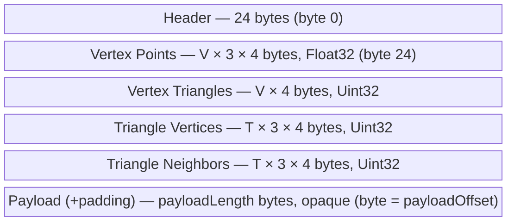

# Binary Serialization Format

The `.bin` files produced by the build pipeline (`npm run pipeline`) wrap a spherical Delaunay triangulation in `spherical-delaunay`'s metadata-agnostic binary container, with WikiRadar's article metadata (titles + popularity weight classes) carried inside that container as an opaque payload. This document specifies the byte-level layout of both layers, so that anyone working with the `spherical-delaunay` package's binary serialization, `src/article-payload.ts`, or `src/app/query.ts` knows exactly what to expect.

Notation: **V** = vertex count, **T** = triangle count. All multi-byte integers and floats are **little-endian**. All Layer 1 numeric sections are **4-byte aligned**.

## Overview


```mermaid
block-beta
    columns 1
    header["Header — 24 bytes (byte 0)"]
    points["Vertex Points — V × 3 × 4 bytes, Float32 (byte 24)"]
    vtri["Vertex Triangles — V × 4 bytes, Uint32"]
    trivert["Triangle Vertices — T × 3 × 4 bytes, Uint32"]
    trineigh["Triangle Neighbors — T × 3 × 4 bytes, Uint32"]
    payload["Payload (+padding) — payloadLength bytes, opaque (byte = payloadOffset)"]
```

The first five blocks (header + four numeric sections) are the geometry container that `spherical-delaunay` owns and understands. The last block is opaque to that library — WikiRadar fills it with the article payload described in Layer 2 below.

## Layer 1: Geometry Container (`spherical-delaunay`)

Defined in the external [`spherical-delaunay`](https://github.com/ChrisSteinbach/spherical-delaunay) package's serialization module. Encodes the triangulation only — vertex positions and the adjacency arrays needed for triangle-walk queries. Knows nothing about articles, titles, or weights; those live entirely inside the opaque payload.

### Header (24 bytes)

| Offset | Size | Type   | Field         | Description                                                     |
| ------ | ---- | ------ | ------------- | --------------------------------------------------------------- |
| 0      | 4    | bytes  | magic         | Magic bytes `0x53 0x44 0x4C 0x54` (ASCII "SDLT")                |
| 4      | 4    | Uint32 | version       | Format version (currently `1`)                                  |
| 8      | 4    | Uint32 | vertexCount   | Number of vertices (V)                                          |
| 12     | 4    | Uint32 | triangleCount | Number of triangles (T)                                         |
| 16     | 4    | Uint32 | payloadOffset | Byte offset where the opaque payload begins (`0` if no payload) |
| 20     | 4    | Uint32 | payloadLength | Byte length of the payload (unpadded)                           |

`deserializeBinary()` validates before reading any data: the buffer is at least 24 bytes, the magic bytes match, the version matches (currently `1`), and the numeric sections fit within the buffer given `V` and `T`. If a payload is declared (`payloadLength > 0`), it also checks that `payloadOffset` doesn't overlap the numeric data and that the payload doesn't run past the end of the buffer. Any violation throws `BinaryFormatError`, preventing silent misinterpretation of corrupt or incompatible data. The version check is strict — any mismatch is rejected outright. This is safe because the deployment workflow regenerates all tiles whenever the format changes.

### Numeric Sections

All four sections are packed contiguously starting at byte 24, in the order listed below. Each uses 4-byte elements, so alignment is naturally maintained, and the payload that follows starts wherever the last section ends.

#### Vertex Points — `Float32[V * 3]`

Flat array of 3D unit-sphere Cartesian coordinates: `[x0, y0, z0, x1, y1, z1, ...]`. Each vertex occupies 3 consecutive Float32 values.

Float32 gives ~7 decimal digits of precision, which on a unit sphere corresponds to sub-meter accuracy — sufficient for geographic nearest-neighbor queries. On deserialization, the app upcasts these to Float64 for runtime math (see `deserializeBinary` in serialization.ts).

#### Vertex Triangles — `Uint32[V]`

One triangle index per vertex. `vertexTriangles[i]` is the index of any triangle incident to vertex `i`. Used as the starting point for enumerating a vertex's neighbors by walking around its triangle fan.

#### Triangle Vertices — `Uint32[T * 3]`

Flat array of vertex indices forming each triangle: `[v0, v1, v2, v3, v4, v5, ...]`. Triangle `t` has vertices at indices `[t*3, t*3+1, t*3+2]`. Vertices are ordered counter-clockwise when viewed from outside the sphere (consistent with the convex-hull orientation used during construction).

#### Triangle Neighbors — `Uint32[T * 3]`

Flat array of adjacent triangle indices: `[n0, n1, n2, n3, n4, n5, ...]`. For triangle `t`, `triangleNeighbors[t*3 + e]` is the triangle sharing the edge from `triangleVertices[t*3 + e]` to `triangleVertices[t*3 + (e+1) % 3]`.

This adjacency structure enables O(√N) triangle-walk point location — starting from any triangle, the algorithm walks toward the query point by crossing edges until it reaches the containing triangle.

### Opaque Payload

Immediately after Triangle Neighbors, at `payloadOffset` (`= 24 + V*3*4 + V*4 + T*3*4 + T*3*4` when present). `spherical-delaunay` treats these bytes as an opaque blob: `serializeBinary(tri, payload?)` copies them in verbatim, and `deserializeBinary()` returns them as a standalone `Uint8Array` copy (never a view into the source buffer), without ever interpreting their contents. When the caller passes no payload, `payloadOffset` is `0`, `payloadLength` is `0`, and `deserializeBinary()` returns an empty `Uint8Array(0)`.

The payload is zero-padded so the total buffer ends on a 4-byte boundary; the padding bytes are not included in `payloadLength`.

## Layer 2: WikiRadar Article Payload (`src/article-payload.ts`)

WikiRadar is the only current consumer of the opaque payload. It packs each tile's article titles and popularity weight classes into the bytes described below, in the same order as the vertex arrays — `articles[i]` and `weights[i]` correspond to vertex `i` in the geometry layer.

### Layout

| Offset (within payload) | Size | Type        | Field   | Description                           |
| ----------------------- | ---- | ----------- | ------- | ------------------------------------- |
| 0                       | 4    | Uint32 (LE) | count   | Number of articles (V)                |
| 4                       | V    | Uint8[V]    | weights | Weight class 0-255 per article        |
| 4 + V                   | rest | UTF-8 JSON  | titles  | JSON array of V article-title strings |

`encodeArticlePayload(articles: ArticleMeta[])` produces this layout; `decodeArticlePayload(payload)` reverses it, returning `{ articles: ArticleMeta[], weights: Uint8Array }` with every article's `weight` populated (`0` when the source article had none). `ArticleMeta` (`{ title: string, weight?: number }`) is defined in this module — `spherical-delaunay` has no notion of it.

Corrupt payloads (too short for the declared count, a titles section that isn't valid JSON, or a titles array whose length doesn't match `count`) throw a plain `Error` with a message prefixed `"Invalid article payload: "` — distinct from `BinaryFormatError`, which only covers the Layer 1 container (magic bytes, version, section bounds).

### Weight Classes

One weight class per article, in the same order as the vertex arrays.

The weight encodes the article's popularity **percentile** among all articles in the same language build, derived from Wikimedia monthly pageviews (see [data-extraction.md](data-extraction.md#pageviews)): `class = round(255 * belowCount / N)`, where `belowCount` is the number of articles in the build with strictly fewer views and `N` is the total article count (see `assignWeightClasses` in `src/pipeline/popularity.ts`). Articles with equal view counts share a class; `0` views (no recorded views, or the article wasn't matched during the pageviews join) always maps to class `0`.

Because the scale is a percentile rather than a raw count, it self-calibrates per language: class `204` means "top 20% most-viewed" whether the build is English (over a million articles) or a small wiki dominated by bot-generated stubs. This lets the app apply one fixed threshold (`HIGHLIGHT_MIN_WEIGHT` in `src/app/config.ts`) across every language without per-language tuning. `--bounds`/`--limit` dev builds compute percentiles relative to the subset, not the full language.

## Size Calculation

```
totalSize = 24                          // header
          + V * 3 * 4                   // vertex points
          + V * 4                       // vertex triangles
          + T * 3 * 4                   // triangle vertices
          + T * 3 * 4                   // triangle neighbors
          + ceil(payloadLength / 4) * 4 // article payload (padded)

payloadLength = 4                       // article count
              + V                       // weight classes
              + titlesJsonByteLength    // UTF-8 JSON of titles
```

For reference, encoding all English articles (over a million; see [data-extraction.md](data-extraction.md) for current counts) in a single file would produce ~120 MB. In practice, the tiled system produces ~800 smaller files totaling ~138 MB (see [tiling.md](tiling.md)).

## Producing and Consuming

**Writer:** `buildTile()` in `src/pipeline/build.ts` calls `encodeArticlePayload()` (`src/article-payload.ts`) to pack each tile's article titles and weight classes into an opaque payload, then `serializeBinary(tri, payload)` (from the `spherical-delaunay` package) to write the triangulation plus that payload into an `ArrayBuffer`, and writes the result with `fs.writeFileSync`.

**Reader:** `loadTile()` in `src/app/tile-loader.ts` fetches `.bin` tile files over HTTP, calls `deserializeBinary()` to get `{ fd, payload }` (Uint32 sections are zero-copy views into the buffer; Float32 vertex data is copied into a Float64Array for runtime precision), then `decodeArticlePayload(payload)` to recover `{ articles, weights }`, and caches the typed arrays and article data in IndexedDB.

**App:** `src/app/query.ts` wraps the deserialized `FlatDelaunay` and `ArticleMeta[]` in a `NearestQuery` instance for geographic lookups.
