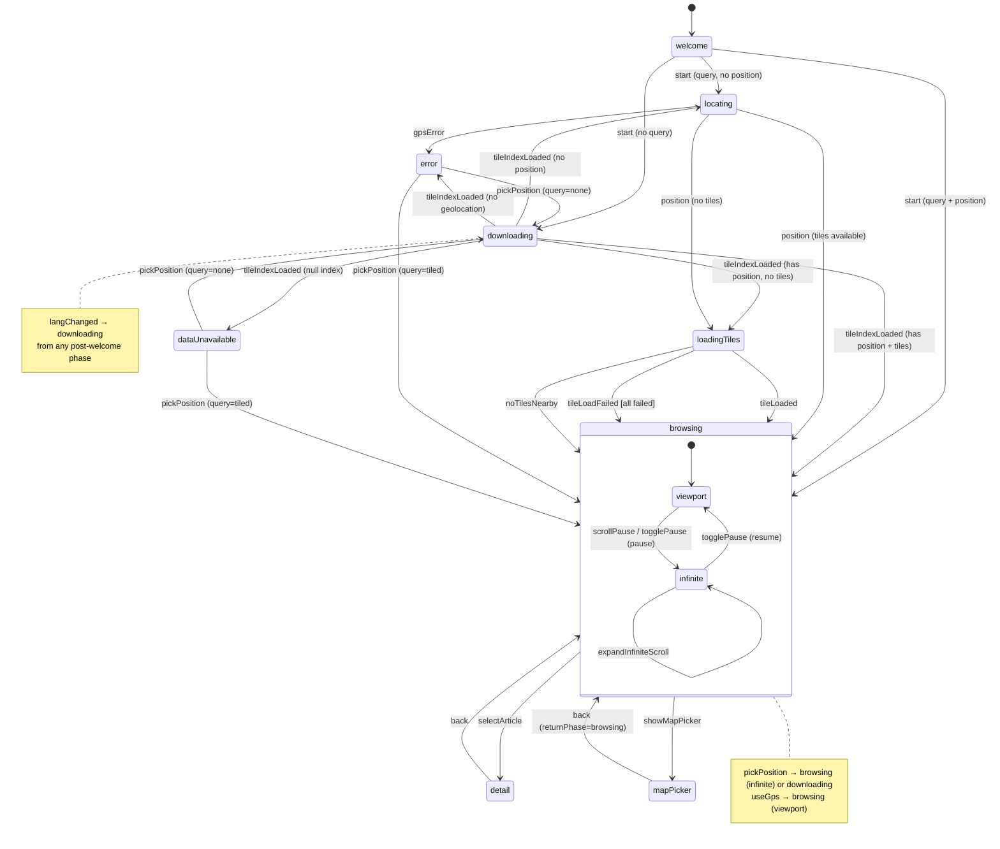

# State Machine

The app is driven by a pure, functional state machine in `src/app/state-machine.ts`. Every user interaction, GPS update, and async completion flows through a single function:

```
transition(state, event) → { next, effects }
```

The transition function has **no side effects** — it takes the current state and an event, returns the next state and a list of effects to execute. This makes the machine easy to test (extensive test suite, ~1,400 lines) and reason about.

`main.ts` hosts the dispatch loop and effect executor that wire the pure machine to the real world (DOM, GPS, network, storage).

## States

The primary UI state is the `Phase` discriminated union. Each phase corresponds to a distinct screen:

| Phase             | Description                                           | Carries                                        |
| ----------------- | ----------------------------------------------------- | ---------------------------------------------- |
| `welcome`         | Landing screen with language picker and start buttons | —                                              |
| `downloading`     | Fetching tile index from CDN                          | `progress` (-1 = not started, 0–1)             |
| `locating`        | Waiting for GPS fix                                   | —                                              |
| `loadingTiles`    | Tile index ready, loading first nearby tile           | —                                              |
| `error`           | GPS failed (denied, timeout, unavailable)             | `error: LocationError`                         |
| `dataUnavailable` | No tile data for the selected language                | —                                              |
| `browsing`        | Main list view with nearby articles                   | Browsing context (see below)                   |
| `detail`          | Article detail page (Wikipedia summary)               | `article`, `savedScrollTop` + browsing context |
| `mapPicker`       | Map view for picking a location                       | `returnPhase` (phase to restore on back)       |

**Browsing context** (shared by `browsing` and `detail`): `articles`, `nearbyCount`, `paused`, `pauseReason`, `lastQueryPos`, `scrollMode`, `infiniteScrollLimit`.

The full `AppState` bundles the phase with supporting fields:

```typescript
interface AppState {
  phase: Phase; // UI state (discriminated union above)
  query: QueryState; // "none" or "tiled" with loaded tile data
  position: UserPosition | null; // Latest GPS fix
  positionSource: "gps" | "picked" | null; // How position was obtained
  currentLang: Lang; // Active language (en, sv, ja)
  loadGeneration: number; // Increments on language change; stale async events are ignored
  loadingTiles: Set<string>; // Tile IDs currently being fetched
  downloadProgress: number; // Latest download fraction (-1 = not started)
  updateBanner: null | "app"; // Whether the SW update banner is showing
  hasGeolocation: boolean; // Whether the Geolocation API is available
  gpsSignalLost: boolean; // True when GPS signal is lost mid-session (cleared on next position)
  viewportFillCount: number; // How many articles to show in the initial viewport-filling view
}
```

### Query state

`QueryState` tracks whether tile data is available:

- **`"none"`** — No data loaded yet. `getNearby()` returns an empty array.
- **`"tiled"`** — Tile index loaded. Holds the index, a tile lookup map, and a map of loaded tiles (each a `NearestQuery` instance for Delaunay walks).

## Events

All inputs to the machine are modeled as a single `Event` union:

| Event                  | Payload                         | Source                                             |
| ---------------------- | ------------------------------- | -------------------------------------------------- |
| `start`                | `hasGeolocation`                | User clicks "Find nearby" or session restore       |
| `pickPosition`         | `position`                      | User picks a location on the map                   |
| `position`             | `pos`                           | GPS `watchPosition` callback                       |
| `gpsError`             | `error`                         | GPS error callback                                 |
| `tileLoadStarted`      | `id`                            | Tile fetch initiated                               |
| `tileIndexLoaded`      | `index`, `lang`, `gen`          | Tile index fetch completed                         |
| `tileLoaded`           | `id`, `tileQuery`, `gen`        | Individual tile fetch completed                    |
| `tileLoadFailed`       | `id`, `gen`                     | Individual tile fetch failed                       |
| `downloadProgress`     | `fraction`, `gen`               | Tile index download progress                       |
| `langChanged`          | `lang`                          | User selects a different language                  |
| `selectArticle`        | `article`, `scrollTop`          | User taps an article in the list                   |
| `back`                 | —                               | Browser popstate or back button                    |
| `scrollPause`          | —                               | User scrolls the article list                      |
| `togglePause`          | —                               | User taps pause/resume button                      |
| `useGps`               | —                               | User taps "Use GPS" button                         |
| `expandInfiniteScroll` | —                               | Scroll sentinel enters viewport                    |
| `showMapPicker`        | —                               | User taps "Pick location" button                   |
| `queryResult`          | `articles`, `queryPos`, `count` | Nearest-neighbor query completed                   |
| `noTilesNearby`        | —                               | Effect executor: no tiles exist near user position |
| `swUpdateAvailable`    | —                               | Service worker controller change                   |

### Generation tracking

The `loadGeneration` counter prevents stale async results from corrupting state. It increments whenever the language changes. Events carrying a `gen` field (`tileIndexLoaded`, `tileLoaded`, `tileLoadFailed`, `downloadProgress`) are silently dropped if their generation doesn't match the current one.

## Effects

Effects are the machine's way of requesting side effects. The transition function never performs I/O — it returns a list of effects, and the executor in `main.ts` interprets them:

| Effect                 | What the executor does                                                      |
| ---------------------- | --------------------------------------------------------------------------- |
| `render`               | Calls `renderPhase()` — full screen redraw based on current phase           |
| `renderBrowsingList`   | Re-renders just the article list (preserves header state)                   |
| `renderBrowsingHeader` | Re-renders only the browsing header (e.g. blink GPS indicator while paused) |
| `updateDistances`      | Patches only distance badges in-place (no DOM rebuild)                      |
| `startGps`             | Calls `watchLocation()`, wires callbacks to dispatch                        |
| `stopGps`              | Stops the GPS watcher                                                       |
| `storeLang`            | Persists language to `localStorage`                                         |
| `storeStarted`         | Persists start timestamp to `localStorage` (checked with TTL on reload)     |
| `loadData`             | Aborts previous load, fetches tile index for the language                   |
| `loadTiles`            | Loads nearby tiles based on current GPS position                            |
| `pushHistory`          | Pushes a history entry (enables browser back for detail→browsing)           |
| `fetchSummary`         | Fetches Wikipedia article summary, renders detail view                      |
| `fetchListSummaries`   | Fetches summaries for all visible articles in the list                      |
| `showMapPicker`        | Opens the map picker UI                                                     |
| `showAppUpdateBanner`  | Appends the SW update banner to the DOM                                     |
| `scrollToTop`          | Scrolls the article list to the top                                         |
| `restoreScrollTop`     | Restores the article list scroll position saved when entering detail view   |
| `requery`              | Runs `getNearby()` synchronously and dispatches a `queryResult` event       |

The `requery` effect is notable: it re-enters the dispatch loop synchronously by calling `getNearby()` and immediately dispatching a `queryResult` event. This keeps the nearest-neighbor computation outside the pure machine while avoiding an async round-trip.

## Transition Diagram



### Startup flow

The `start` event branches based on two conditions — whether tile data is ready (`query.mode !== "none"`) and whether a GPS position exists:

| Query ready? | Position? | Destination                      |
| ------------ | --------- | -------------------------------- |
| Yes          | Yes       | `browsing` (immediate requery)   |
| Yes          | No        | `locating` (wait for GPS)        |
| No           | —         | `downloading` (fetch tile index) |

### Transition table

| From                | Event                  | Condition                   | To                           | Key effects                                                         |
| ------------------- | ---------------------- | --------------------------- | ---------------------------- | ------------------------------------------------------------------- |
| `welcome`           | `start`                | query=none                  | `downloading`                | storeStarted, startGps, render                                      |
| `welcome`           | `start`                | query ready, has position   | `browsing`                   | storeStarted, startGps, requery                                     |
| `welcome`           | `start`                | query ready, no position    | `locating`                   | storeStarted, startGps, render                                      |
| `downloading`       | `downloadProgress`     | —                           | `downloading`                | render (progress bar)                                               |
| `downloading`       | `tileIndexLoaded`      | has index, has position     | `browsing` or `loadingTiles` | loadTiles, requery or render                                        |
| `downloading`       | `tileIndexLoaded`      | has index, no position      | `locating`                   | render                                                              |
| `downloading`       | `tileIndexLoaded`      | has index, no geolocation   | `error`                      | render                                                              |
| `downloading`       | `tileIndexLoaded`      | null index                  | `dataUnavailable`            | render                                                              |
| any                 | `pickPosition`         | query=none                  | `downloading`                | stopGps, render                                                     |
| any                 | `pickPosition`         | query=tiled                 | `browsing` (infinite scroll) | stopGps, loadTiles, requery                                         |
| `locating`          | `position`             | tiled, no tiles loaded      | `loadingTiles`               | loadTiles, render                                                   |
| `locating`          | `position`             | tiles available             | `browsing`                   | loadTiles, requery                                                  |
| `locating`          | `gpsError`             | —                           | `error`                      | render                                                              |
| `loadingTiles`      | `tileLoaded`           | has position                | `browsing`                   | requery                                                             |
| `loadingTiles`      | `tileLoadFailed`       | last pending, some loaded   | `browsing`                   | requery, scrollToTop                                                |
| `loadingTiles`      | `tileLoadFailed`       | last pending, none loaded   | `browsing`                   | renderBrowsingList                                                  |
| `loadingTiles`      | `noTilesNearby`        | has position                | `browsing`                   | renderBrowsingList                                                  |
| `browsing`          | `position`             | moved ≥15m, not paused      | `browsing`                   | loadTiles, requery                                                  |
| `browsing`          | `position`             | paused by scroll            | `browsing`                   | loadTiles, renderBrowsingHeader                                     |
| `browsing`          | `position`             | moved <15m or paused other  | `browsing`                   | (loadTiles only)                                                    |
| `browsing`          | `scrollPause`          | not already paused/infinite | `browsing` (infinite scroll) | requery (INFINITE_SCROLL_INITIAL)                                   |
| `browsing`          | `togglePause`          | paused→unpaused             | `browsing` (viewport scroll) | scrollToTop, requery, renderBrowsingList, fetchListSummaries        |
| `browsing`          | `togglePause`          | unpaused→paused             | `browsing` (infinite scroll) | requery (INFINITE_SCROLL_INITIAL)                                   |
| `browsing`          | `expandInfiniteScroll` | in infinite scroll mode     | `browsing`                   | requery (limit += INFINITE_SCROLL_STEP)                             |
| `browsing`          | `useGps`               | has position                | `browsing` (viewport mode)   | startGps, requery, scrollToTop                                      |
| `browsing`          | `useGps`               | no position                 | `browsing` (viewport mode)   | startGps, renderBrowsingList                                        |
| `detail`            | `useGps`               | has position                | `detail` (viewport mode)     | startGps, scrollToTop                                               |
| `detail`            | `useGps`               | no position                 | `detail` (viewport mode)     | startGps, renderBrowsingList                                        |
| any                 | `showMapPicker`        | —                           | `mapPicker`                  | pushHistory, showMapPicker                                          |
| `mapPicker`         | `back`                 | —                           | (returnPhase)                | renderBrowsingList or render                                        |
| `browsing`          | `selectArticle`        | —                           | `detail`                     | pushHistory, fetchSummary                                           |
| `browsing`          | `queryResult`          | articles changed, infinite  | `browsing`                   | renderBrowsingList                                                  |
| `browsing`          | `queryResult`          | articles changed, viewport  | `browsing`                   | renderBrowsingList, fetchListSummaries                              |
| `browsing`          | `queryResult`          | same articles               | `browsing`                   | updateDistances                                                     |
| `detail`            | `back`                 | not infinite scroll         | `browsing`                   | renderBrowsingList, fetchListSummaries, restoreScrollTop (if saved) |
| `detail`            | `back`                 | infinite scroll             | `browsing`                   | renderBrowsingList, restoreScrollTop (if saved)                     |
| `detail`            | `position`             | —                           | `detail`                     | loadTiles, render                                                   |
| `browsing`          | `tileLoaded`           | —                           | `browsing`                   | requery                                                             |
| `detail`            | `tileLoaded`           | —                           | `detail`                     | (tile data stored in query state)                                   |
| any (post-welcome)  | `langChanged`          | —                           | `downloading`                | storeLang, loadData, render                                         |
| any                 | `tileLoadStarted`      | —                           | (unchanged)                  | (tracks tile ID in loadingTiles)                                    |
| any                 | `swUpdateAvailable`    | no banner yet               | (unchanged)                  | showAppUpdateBanner                                                 |
| `browsing`/`detail` | `gpsError`             | GPS source active           | (unchanged, gpsSignalLost)   | render                                                              |
| `locating`          | `gpsError`             | —                           | `error`                      | render                                                              |

Events not listed for a given phase (e.g. `selectArticle` during `downloading`) are no-ops — the transition returns the current state with no effects.

## Key Design Decisions

### Phase gating

GPS errors transition to `error` only during the `locating` phase. During `browsing` or `detail`, a GPS error sets `gpsSignalLost` (used by the UI to show a warning indicator) but does not change the phase — the user can keep browsing with their last known position.

### Smart re-rendering

When a `queryResult` arrives, the machine compares the new article list against the current one. If the titles are identical (user hasn't moved enough to change the ranking), it emits `updateDistances` instead of `renderBrowsingList`. This patches only the distance badges in-place, preserving dropdown focus and scroll position.

### Browsing context preservation

The `browsing` and `detail` phases share `articles`, `nearbyCount`, `paused`, and `lastQueryPos`. When `selectArticle` transitions to `detail`, these fields are copied into the detail phase. When `back` returns to `browsing`, they're restored — the article list reappears exactly as the user left it.

### Requery threshold

Position updates only trigger a requery if the user has moved at least 15 meters (`REQUERY_DISTANCE_M`) from their last query position. This avoids excessive recalculation from GPS jitter while still responding promptly to real movement.

### Infinite scroll

When position is stable (picked or GPS-paused), the list switches to infinite scroll mode. The initial query fetches `INFINITE_SCROLL_INITIAL` (200) articles, and each `expandInfiniteScroll` event (triggered by a scroll sentinel) grows the limit by `INFINITE_SCROLL_STEP` (200). Unpausing switches back to viewport mode with a smaller count. See [Infinite Scroll](infinite-scroll.md) for the full virtual-scroll and article-window lifecycle.

### Pure machine, impure executor

Separating the transition logic from side effects yields several benefits:

- **Testability** — The test suite exercises the full machine with plain objects, no mocks needed for DOM, GPS, or network.
- **Predictability** — Given the same state and event, the machine always produces the same result.
- **Effect batching** — The executor processes effects sequentially after the state has been updated, avoiding intermediate inconsistent states.

## Dispatch Loop

The runtime in `main.ts` is minimal. The following is a simplified sketch — the actual implementation includes error handling and guard logic:

```typescript
function dispatch(event: Event): void {
  const { next, effects } = transition(appState, event);
  appState = next;
  for (const effect of effects) {
    executeEffect(effect); // may re-enter dispatch (e.g. requery)
  }
}
```

External inputs feed into `dispatch`: GPS callbacks, DOM event listeners, async fetch completions, and the browser's `popstate` event. The executor interprets each effect — some (like `requery`) re-enter `dispatch` synchronously, while others (like `loadData`) trigger async work that eventually dispatches new events.

## Bootstrap Sequence

On page load, `main.ts` runs:

1. **Clean up IDB** — Remove orphaned keys from old schema versions.
2. **Listen for SW updates** — Wire `controllerchange` to dispatch `swUpdateAvailable`.
3. **Load language data** — `dispatch({ type: "langChanged", lang })` triggers tile index fetch.
4. **Restore or welcome** — If `localStorage` has a fresh `tour-guide-started` timestamp (within the 1-hour TTL), dispatch `start` immediately. Otherwise render the welcome screen with a button that dispatches `start`.

## See Also

- [Architecture Overview](architecture.md) — End-to-end system design and data flow
- [Infinite Scroll](infinite-scroll.md) — Virtual scroll, article window, scroll-pause transitions
- [Nearest-Neighbor Theory](nearest-neighbor.md) — Delaunay triangle walks and BFS expansion
- [Tiling Strategy](tiling.md) — Geographic tiling, buffer zones, on-demand loading
